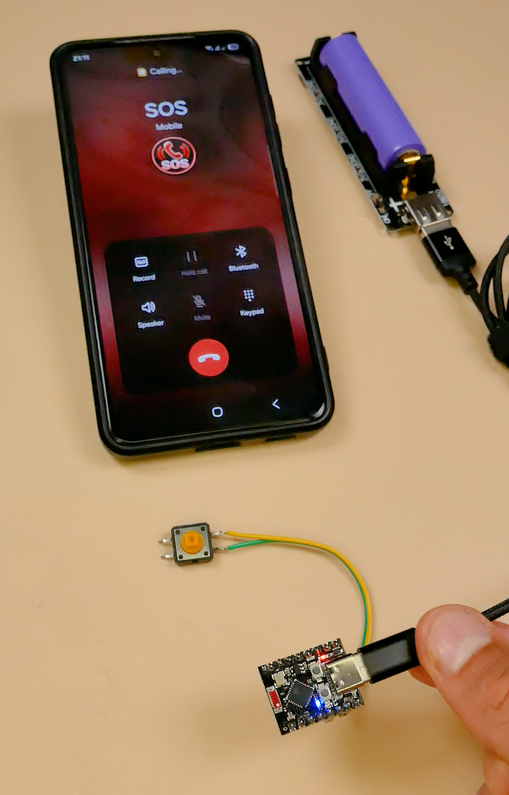
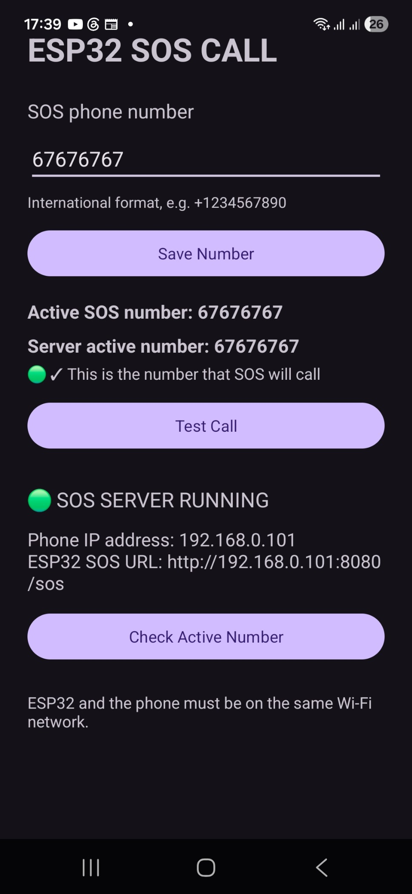

# ESP32 SOS Button

DIY-проект **SOS-кнопки на ESP32-C3**, которая по нажатию отправляет команду на Android-смартфон по Wi-Fi, а телефон выполняет обычный мобильный вызов на заранее заданный SOS-номер через SIM-карту.



## Как это работает


1. Нажимаем кнопку.
2. ESP32 сразу отправляет HTTP-запрос на телефон.
3. Android-приложение принимает `/sos`.
4. Телефон запускает обычный вызов на сохранённый SOS-номер через SIM.
5. Приложение возвращает `SOS OK`.
6. ESP32 включает встроенный синий LED постоянно — это подтверждение, что приложение приняло команду на вызов.

> **Важно:** `SOS OK` означает, что Android-приложение приняло запрос и инициировало вызов. Это не означает, что абонент на другом конце уже ответил.

---

## Что понадобится

- ESP32-C3 Super Mini
- кнопка
- USB-кабель
- Android-смартфон с SIM и мобильной связью
- Wi-Fi сеть
- компьютер с Arduino IDE

---

# 1. Установка Android-приложения

APK находится здесь:

```text
Android-App/ESP32-SOS-Call.apk
```

Установите APK на телефон.

Если Android попросит разрешить установку приложений из данного источника — включите **Allow from this source**.

Откройте приложение:



Введите номер, на который должен поступать SOS-вызов, и нажмите:

**Save Number**

Проверьте:

- `Active SOS number`
- `Server active number`
- `SOS SERVER RUNNING`

Приложение также показывает IP телефона, например:

```text
Phone IP address: 192.168.0.101
```

Этот IP понадобится для прошивки ESP32.

### Обязательно протестируйте звонок

Нажмите:

**Test Call**

Убедитесь, что телефон действительно звонит на сохранённый номер.

---

# 2. Установка Arduino IDE

Установите Arduino IDE.

Если ESP32 ещё не установлен:

1. **File → Preferences**
2. Добавьте URL Espressif Boards Manager.
3. **Tools → Board → Boards Manager**
4. Найдите `esp32`
5. Установите **ESP32 by Espressif Systems**

Выберите:

```text
ESP32C3 Dev Module
```

и COM-порт вашей платы.

---

# 3. Настройка скетча

Откройте:

```text
ESP32/ESP32-SOS-Button.ino
```

В начале скетча находятся:

```cpp
const char* WIFI_SSID = "YOUR_WIFI_NAME";
const char* WIFI_PASSWORD = "YOUR_WIFI_PASSWORD";
const char* PHONE_IP = "192.168.0.101";
```

Измените их на свои значения.

Например:

```cpp
const char* WIFI_SSID = "MyHomeWiFi";
const char* WIFI_PASSWORD = "12345678";
const char* PHONE_IP = "192.168.0.101";
```

### Очень важно

Телефон и ESP32 должны находиться в одной Wi-Fi сети.

Например:

```text
Phone:  192.168.0.101
ESP32:  192.168.0.102
Router: 192.168.0.1
```

Если IP телефона изменился, его нужно заменить в `PHONE_IP` и снова загрузить прошивку.

---

# 4. Подключение кнопки

Используется внутренний pull-up резистор ESP32:

```text
GPIO 4 ───── КНОПКА ───── GND
```

Внешний резистор не нужен.

Встроенный синий LED используется для индикации, поэтому внешний светодиод не требуется.

---

# 5. Загрузка прошивки

Подключите ESP32-C3 к компьютеру.

В Arduino IDE:

```text
Tools → Board → ESP32C3 Dev Module
Tools → Port → COM вашей платы
```

Нажмите **Upload**.

После загрузки откройте:

**Tools → Serial Monitor**

Скорость:

```text
115200
```

---

# 6. Проверка

После подключения к Wi-Fi увидите:

```text
[WiFi] Connected!
[WiFi] IP address: 192.168.0.102

[Phone] SOS URL:
http://192.168.0.101:8080/sos

[SYSTEM] READY
```

Нажмите кнопку.

ESP32 сразу отправит SOS:

```text
[SOS] HTTP code: 200
[SOS] Server response:
SOS OK
Calling: 67676767
```

После этого:

```text
SOS SENT SUCCESSFULLY
PHONE SHOULD CALL
```

Телефон должен начать вызов.

---

# Индикация встроенного LED

| Состояние | LED |
|---|---|
| Подключение к Wi-Fi | быстро мигает |
| Wi-Fi подключён, ожидание | медленно мигает |
| Отправка SOS | выключен |
| Получен `SOS OK` | **горит постоянно** |
| Ошибка | 5 быстрых вспышек |

---

# Если не работает

### `connection refused`

Проверьте:

- приложение запущено;
- отображается `SOS SERVER RUNNING`;
- телефон и ESP32 подключены к одной Wi-Fi сети;
- `PHONE_IP` совпадает с IP в приложении;
- используется порт `8080`.

ESP32 автоматически делает до 3 попыток.

### Изменился IP телефона

Если приложение показывает:

```text
Phone IP address: 192.168.0.105
```

измените:

```cpp
const char* PHONE_IP = "192.168.0.105";
```

и снова загрузите скетч.

### Test Call работает, а ESP32 нет

Проверьте IP телефона и Serial Monitor. Главный признак успешного обмена:

```text
HTTP code: 200
SOS OK
```

---

# Структура проекта

```text
ESP32-SOS-Button/
│
├── ESP32/
│   └── ESP32-SOS-Button.ino
│
├── Android-App/
│   └── ESP32-SOS-Call.apk
│
├── docs/
│   └── images/
│       ├── project.jpg
│       ├── android-app.jpg
│       └── serial-monitor.png
│
├── README.md
├── README_RU.md
├── LICENSE
└── .gitignore
```

## Важный момент

Проект зависит от питания ESP32, Wi-Fi, Android-смартфона, приложения и мобильной сети. Перед использованием в реальной экстренной ситуации обязательно полностью протестируйте систему.

Не используйте этот DIY-проект как единственный способ связи с экстренными службами.
